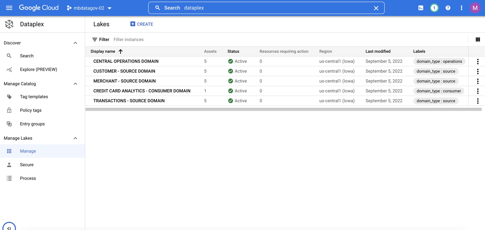
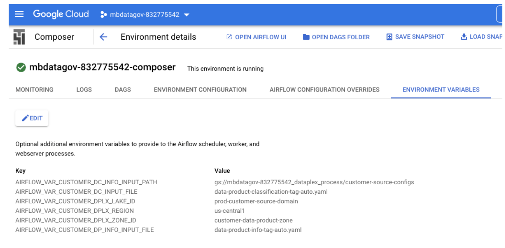

# Cloud Dataplex Self-service labs

## Pre-requisites


- For Argolis Account
    1. Use "admin@" account 
    2. Create a new Argolis Project for this lab 
    3. Make sure "admin@" user has the below privileges
        - Owner
        - ServiceAccountTokenCreator
        - Organization Admin 
        
    4. Make sure you have enough of disk space(1.5 GB - 2 GB) in your gCloud shell for the terraform setup 

- For Non-Argolis Account 
    1.  Create a GCP Project 
        1.1. Create a new GCP project and follow the guidelines [here](https://cloud.google.com/dataplex/docs/best-practices#choose_project). 
    
        1.2. The project must belong to the same [VPC Service Control perimeter](https://cloud.google.com/vpc-service-controls/docs/service-perimeters) as the data destined to be in the lake. Refer to this link to use or [add Dataplex to VPC-SC](https://cloud.google.com/dataplex/docs/vpc-sc). 
         
    2. Make sure both data and Dataplex regions are available in one of the Dataplex [supported regions](https://cloud.google.com/dataplex/docs/locations?hl=en_US)
    3. Organization Policies: 
        The org policies should be set to below:

        - "compute.requireOsLogin" : false,
        - "compute.disableSerialPortLogging" : false,
        - "compute.requireShieldedVm" : false
        - "compute.vmCanIpForward" : true,
        - "compute.vmExternalIpAccess" : true,
        - "compute.restrictVpcPeering" : true
        - "compute.trustedImageProjects" : true,
        - "iam.disableCrossProjectServiceAccountUsage" :false #Only required when you want to setup in a seperate project to your data project 

    4. Enable [Private Google Access](https://cloud.google.com/vpc/docs/configure-private-google-access#config-pga) on the network you plan to use with Dataplex Data Quality tasks. If you don't specify a network or sub-network when creating the Dataplex Data Quality task, Dataplex will use the default subnet, and you will need to enable Private Google Access for the default subnet.

    5. Make sure you have the appropriate Dataplex quotas 
        ```
        ## dataplex.googleapis.com/zones in region:us-central1 should be at least 20
        ## dataplex.googleapis.com/lakes in region:us-central1 should be at least 5

        ```
        You can view these settings at https://console.cloud.google.com/iam-admin/quotas and then enter the filters - Metric:dataplex.googleapis.com/zones OR Metric:dataplex.googleapis.com/lakes region:us-central1 
    6. Make sure you have enough of disk space(1.5 GB - 2 GB)  for the terraform setup 

## Setup

1. [](https://console.cloud.google.com/cloudshell/editor)

2. Select the appropriate project. Make sure you are in the right project before you proceed. 

3. Install the below python libraries 

    ```bash
    pip3 install google-cloud-storage
    pip3 install numpy 
    pip3 install faker_credit_score
    ```

4. Declare variable 
In cloud shell, declare the following variables after substituting with yours.

    ```bash
    echo "export USERNAME=your-email" >> ~/.profile
    echo "export PROJECT_ID=$(gcloud config get-value project)" >> ~/.profile
    ```

For Argolis, use fully qualified corporate email address - ldap@fgoogle.com otherwise use your fully qualified email address (e.g. joe.user@gmail.com) as the USERNAME

5. To get the currently logged in email address, run: 'gcloud auth list as' below:

    ```bash 
    gcloud auth list
    Credentialed Accounts

    ACTIVE: *
    ACCOUNT: joe.user@jgmail.com or admin@(for Argolis)
    ```

6. Clone this repository in Cloud Shell
   ```bash 
   git clone https://github.com/mansim07/dataplex-labs.git
   ```

7. Trigger the terraform script to setup the infrastructure 

    ```bash 
    cd ~/dataplex-labs/setup/
    source ~/.profile
    bash deploy-helper.sh ${PROJECT_ID} ${USERNAME}
    ```
    The scrirpt will take about 30-40 minutes to finish.

8. Validate the Dataplex lakes and zones are created with the right number of asserts as shown below. Go to Dataplex -> Manage
 
    

9. Go to Composer… Then Environments…  Click on <your-project-id>-composer link..then click on 'Environment Variables'
    


## Labs 

We have a series of labs designed to get hands-on-experience with Dataplex concepts. Please refer to each of the lab specific README for more information on the labs

| Lab# | Lab Title | Description | link to readme |
| ------------- | ------------- | ------------- | ------------- |
| Lab 1  | Manage Data Security using Dataplex  | Managing Data Security is the main goal of this lab. You will learn how to design and manage security policies using Dataplex's UI and REST API as part of the lab. The purpose of the lab is to learn how to handle distributed data security more effectively across data domains| [ReadMe](https://github.com/mansim07/dataplex-labs/blob/main/lab1/README.md)  |
| Lab 2  | Standardize data using Dataplex built in task | You will discover how to leverage common Dataplex templates to curate raw data and translate it into standardized formats like parquet and Avro in the Data Curation lane. This demonstrates how domain teams may quickly process data in a serverless manner and begin consuming it for testing purposes.|[ReadMe](https://github.com/mansim07/dataplex-labs/tree/main/lab2)  |
| Lab 3  | Build Data Products | Learn how you can move incremental data using [Configuration-driven Dataproc Templates](https://github.com/GoogleCloudPlatform/dataproc-templates) from GCS to BQ & transform using BigQuery  | [ReadMe](https://github.com/mansim07/dataplex-labs/blob/main/lab3/README.md)  |
| Lab 4(TBD) | Tag templates and bulk tagging Data products | You will use DLP Data Profiler in this lab so that it can automatically classify the BQ data, which will then be used by a Dataplex  to provide business tags/annotations | [ReadMe](https://github.com/mansim07/dataplex-labs/tree/main/lab4) |
| Lab 5(TBD) | Data Quality and Tagging| You will learn how to define and perform Data Quality jobs on customer data in the Data Quality lab, evaluate and understand the DQ findings, and construct a dashboard to assess and monitor DQ , creating tags |[ReadMe](https://github.com/mansim07/dataplex-labs/tree/main/lab5#readme) | 
| Lab 6(TBD) | Data catalog Search and Data Lineage| In this lab we will explore the Data Catalog, how to perform advanced searches, look at Data Lineage| [ReadMe](https://github.com/mansim07/dataplex-labs/tree/main/lab6)) | 


## [Optional] Post Work
Create HMS and attach it to the lake. Follow the instructions here
Create multiple personas/roles in Cloud Indentity and play around with the security policies
Become more creative and share ideas
Don't forget post-survey and feedback

## Clean up
Please make sure you clean up your environment

#Remove lien if any
gcloud alpha resource-manager liens list --project ${PROJECT_ID}
gcloud projects delete ${PROJECT_ID}


## Common Issues and Erros  

1. │ Error: googleapi: Error 400: You can't create a Composer environment due to Organization Policy constraints in the selected project.
│ Policy constraints/compute.vmExternalIpAccess must allow all values when creating Public IP Cloud Composer environments., failedPrecondition

2. ╷
│ Error: googleapi: Error 400: You can't create a Composer environment due to Organization Policy constraints in the selected project.
│ Policy constraints/compute.vmExternalIpAccess must allow all values when creating Public IP Cloud Composer environments., failedPrecondition
│
│   with module.composer.google_composer_environment.composer_env,
│   on modules/composer/composer.tf line 127, in resource "google_composer_environment" "composer_env":
│  127: resource "google_composer_environment" "composer_env" {
